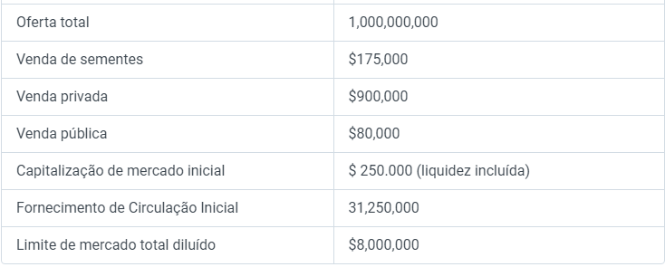

# Alocação de token

### Resumo do token

Símbolo: SEB

### Alocação

.png>)

### Utilitário

.png>)

* Adicionar liquidez
* Listagens de trocas
* Recompensas para estaking, programas de mineração de liquidez e aumentar a liquidez para tokens SEB
* Atividades para manter a liquidez e apoiar o crescimento do preço do token SEB.

**Marketing e Parceria:** Esses tokens serão usados para várias iniciativas e estratégias de marketing e parceria.
